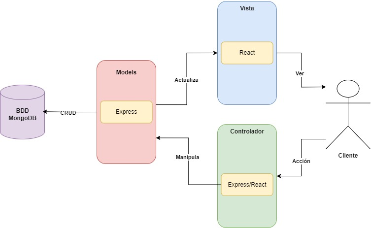

# Mini-Core

Este mini-core fue realizado en express.js para el backend y react para el frontend

## Descripción del proyecto
Se tienen dos tablas, una de vendedores y otra de ventas, un vendedor puede tener varias ventas.
Las ventas tienen una fecha y un monto, que son los elementos principales que se utilizan para la lógica del proyecto.

El objetivo es encontrar en un rango de fechas las ventas pertenecientes a cada ventas y mostrar cual fue el producto más vendido en dichas fechas

## Link del video: 
[Video ejecucion](https://udlaec-my.sharepoint.com/:v:/g/personal/kevin_rosero_udla_edu_ec/Eap72YVZ7y9HlXn6HFedrIEBPXuWpwb1XrIkK-7pAlXEGg?nav=eyJyZWZlcnJhbEluZm8iOnsicmVmZXJyYWxBcHAiOiJPbmVEcml2ZUZvckJ1c2luZXNzIiwicmVmZXJyYWxBcHBQbGF0Zm9ybSI6IldlYiIsInJlZmVycmFsTW9kZSI6InZpZXciLCJyZWZlcnJhbFZpZXciOiJNeUZpbGVzTGlua0RpcmVjdCJ9fQ&e=7FaAiq)
## Diagrama de la  Aplicación del diseño de ingeniería

Primero comenzamos con el cliente realizando una acción en el aplicativo (Controladores), estos se manejan de manera conjunta tanto del lado backend, que es donde se crean estos métodos y se setean las rutas para ser consumidas desde el frontend (en este caso tenemos todos los controladores de la consulta), estos controladores manipulan los modelos definidos en la base de datos (models) estos son creados en la base de datos MongoDB con ayuda de Express y con ayuda de la biblioteca de modelado de objetos para Node.js y mongoDB mongoose. Por último con ayuda del framework REACT mostraremos toda la información al cliente cumpliéndose la estructura MVC con ayuda de las herramientas combinadas MERN (MongoDB, Express, React, Node).

